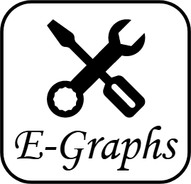

# Bachelorarbeit - EGraphs 

Das Ziel dieser Bachelorarbeit ist es, ein sinnvolles Werkzeug für die Lehre zu erstellen,
um Studentinnen und Studenten die Themen **E-Graphs** und **Equality Saturation** näher zu bringen.
Dabei sollen sie die Möglichkeit haben, sich sowohl auf theoretischer als auch praktischer Ebene mit E-Graphs auseinander setzen zu können.
Die theoretische Ebene soll den Studenten die notwendigen Hintergrundkenntnisse vermitteln sowie einen Enblick in die Implementierung geben.
Die praktische Ebene soll Schritt für Schritt aufzeigen, wie der **E-Graph** aufgebaut wird, und wie an diesem **Equality Saturation** durchgeführt werden kann.
Für größtmöglichen Nutzen soll die Anwendung plattformunabhängig sein und möglichst nur von _Open-Source-Software_ (OSS) Gebrauch machen.
Damit wird das Problem der unterschiedlichen Betriebssysteme der Studenten umgangen und zeitgleich die Hürden für Erweiterungen gesenkt.

## Overview

## Setup

## Dependencies

## License

This project is licensed under MIT License. For more information, please click [here](https://github.com/BenSt099/Bachelorarbeit-EGraphs/blob/main/LICENSE). Das Icon im Logo stammt von [Bootstrap](https://icons.getbootstrap.com/icons/tools/).