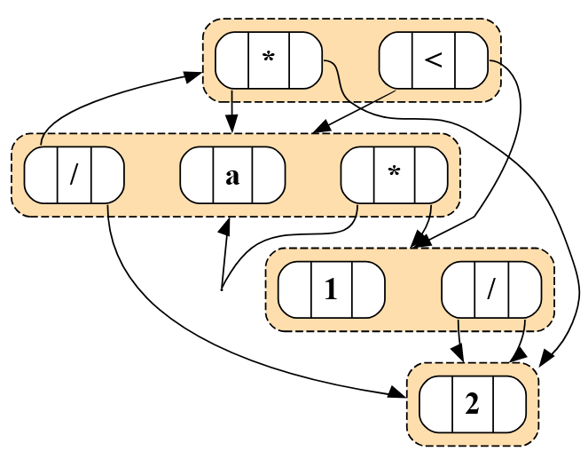

# Bachelorarbeit - EGraphs <a href="https://github.com/BenSt099/Bachelorarbeit-EGraphs"></a>

Das Ziel dieser Bachelorarbeit ist es, ein sinnvolles Werkzeug für die Lehre zu erstellen,
um Studentinnen und Studenten die Themen **E-Graphs** und **Equality Saturation** näherzubringen.
Dabei sollen sie die Möglichkeit haben, sich sowohl auf theoretischer als auch praktischer Ebene mit E-Graphs auseinandersetzen zu können.
Die theoretische Ebene soll den Studenten die notwendigen Hintergrundkenntnisse vermitteln sowie einen Einblick in die Implementierung geben.
Die praktische Ebene soll Schritt für Schritt aufzeigen, wie der **E-Graph** aufgebaut wird, und wie an diesem **Equality Saturation** durchgeführt werden kann.
Für größtmöglichen Nutzen soll die Anwendung plattformunabhängig sein und möglichst nur von _Open-Source-Software_ (OSS) Gebrauch machen.
Damit wird das Problem der unterschiedlichen Betriebssysteme der Studenten umgangen und zeitgleich die Hürden für Erweiterungen gesenkt.

## Overview



## Setup

1. Bitte installieren Sie die [Dependencies](##Dependencies).
2. Laden Sie sich den Code herunter.

## Dependencies

Die notwendigen Pakete finden Sie in [requirements.txt](https://github.com/BenSt099/Bachelorarbeit-EGraphs/blob/main/code/requirements.txt):

```shell
pip install -r requirements.txt
```

## Tests

Wenn Sie die Tests ausführen möchten, fügen sie entweder Folgendes zu ``requirements.txt`` hinzu: ``pytest==8.3.3`` oder
installieren Sie das Paket händisch: ```pip install pytest==8.3.3```.

## License

Dieses Projekt wird unter der **MIT License** veröffentlicht. Für weiterführende Informationen klicken Sie bitte [hier](https://github.com/BenSt099/Bachelorarbeit-EGraphs/blob/main/LICENSE). Das Icon im Logo wurde aus dem Framework [Bootstrap](https://icons.getbootstrap.com/icons/tools/) genommen.
