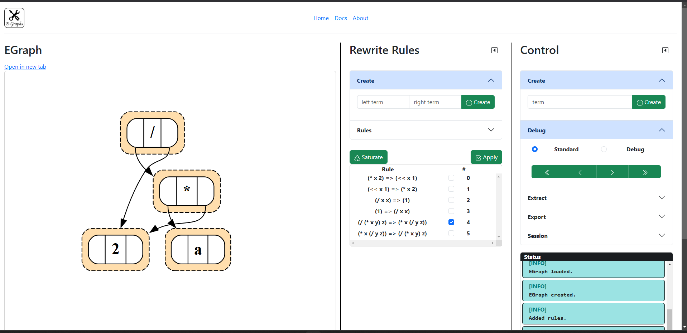

# Benutzung

Nach dem Starten der Anwendung öffnet sich ein Browser-Fenster und die Benutzeroberfläche erscheint. Sie ist in drei Segmente unterteilt:

## E-Graph

In diesem Segment wird der E-Graph (falls vorhanden) gerendert. Der E-Graph kann mithilfe des Mausrades oder des Touchpads vergrößert und verkleinert werden.
Zudem kann er mit dem Cursor hin- und hergezogen werden.

Der Link _Open in new tab_ öffnet die gleiche Ansicht in einem neuen Tab. Das kann hilfreich sein, wenn der vorhandene Bildschirm zu klein ist oder der E-Graph getrennt
betrachtet werden soll.

Das **Hovern** mit dem Cursor über einzelne, beige eingefärbte E-Classes verrät die EClass-ID.

## Rewrite Rules

Dieses Segment steuert die Erzeugung und Anwendung von Rewrite Rules. Genaueres gibt es [hier](/docs/benutzung/rewriterules/).

## Control

Dieses Segment steuert die restlichen Abläufe, inklusive der Erstellung von E-Graphs. Mehr dazu finden Sie [hier](/docs/benutzung/control/).
