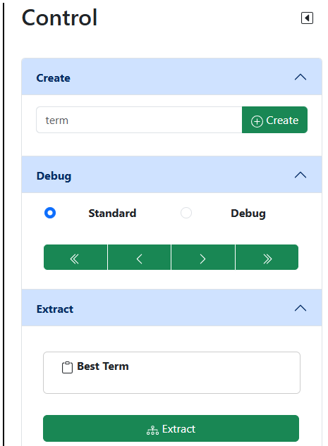
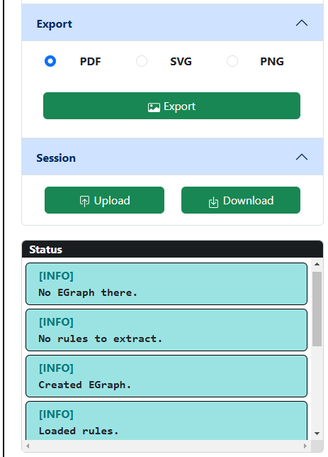

# Control

## Teil 1

Der kleine schwarze Pfeil rechts oben minimiert dieses Segment.

### Create

### Debug

### Extract

Durch das Drücken des Buttons **Extract** wird der optimale Term aus dem E-Graph extrahiert und im darüber liegenden Feld angezeigt.
Wenn Sie den Term in die lokale Zwischenablage kopieren möchten, drücken Sie auf den Button **Best Term**.
Wenn Sie den Prozess beobachten möchten, muss der Debug-Modus aktiviert sein. Statusmeldungen erfolgen automatisch.

## Teil 2

### Export

Der E-Graph, der momentan angezeigt wird, kann in ein Dateiformat exportiert werden. Die entsprechende Datei wird im selben Verzeichnis wie
die Anwendung erstellt.

### Session

Eine Session beinhaltet folgendes:

- Term, aus dem der E-Graph erzeugt wurde.
- Rewrite Rules
- 

Wenn Sie ihren Lernstand beibehalten möchten, können Sie auf **Download** drücken. Eine JSON-Datei wird im Verzeichnis dieser Anwendung erstellt. Achten Sie auf die Statusmeldung unten rechts auf der Benutzeroberfläche.
Dort wird der Download zusammen mit dem Speicherort noch einmal bestätigt.

Wenn Sie die Anwendung jetzt herunterfahren und sie erneut starten, können Sie über den Button **Upload** die Datei auf den Server laden. Auch das wird erneut mit einer Statusmeldung bestätigt.

**Achtung**: Sollten Sie den Inhalt der Datei verändert oder das Format beschädigt haben, kann es eventuell passieren, dass die Datei nicht angenommen wird.

### Status

Im Status-Feld werden Meldungen des Servers angezeigt. Dabei gibt es folgende Typen von Meldungen: INFO, WARN und ERROR.
Für detailierte Meldungen, zum Beispiel beim Anwenden einer Rewrite Rule, muss der Debug-Modus aktiviert sein.
