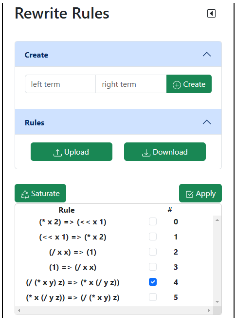

# Rewrite Rules

Der kleine schwarze Pfeil rechts oben minimiert dieses Segment.

## Create

Für die Erstellung einer Rewrite Rule müssen zwei Eingaben gemacht werden: ein linker und ein rechter Term. Tragen Sie dort jeweils ihre Terme ein und drücken Sie auf den
Button **Create**. Die Regel wird damit zur Anwendung hinzugefügt.

**Bemerkung**: Eine Rewrite Rule hat keine Richtung, kann also auch andersherum angewendet werden. Daher wird bei der Erstellung einer Regel die gegenteilige Regel automatisch hinzugefügt. 

### Syntax der Rewrite Regeln

Wie im Beispiel oben zu sehen ist die Syntax wie folgt:

- folgende Operationen werden unterstützt: +, -, *, /, \<\< (left-shift), >> (right-shift)
- positive ganze Zahlen (auch mehrstellig) | **Beispiel**: 42, 892 
- Variablen, die mit einem Buchstaben anfangen (auch mit mehr als einem Zeichen) | **Beispiel**: var09, x

Eine Rewrite Rule wird in _prefix_-Notation angegeben, d.h. die Operation steht vorne, danach die beiden Argumente. **Beispiel**: (/ x y) steht für: x / y.

Operationen müssen geklammert werden. Das gilt auch für eine einzelne Variable / Zahl. | **Beispiel**: (var), (1).

## Rules

Um nicht immer alle Rewrite Rules händisch eingeben zu müssen, können Sie die Regeln Betätigen des Buttons **Download** herunterladen.
Damit wird eine JSON-Datei im selben Verzeichnis wie die Anwendung erstellt. Achten Sie auf die Statusmeldung unten rechts auf der Benutzeroberfläche.
Dort wird der Download zusammen mit dem Speicherort noch einmal bestätigt.

Wenn Sie die Anwendung jetzt herunterfahren und sie erneut starten, können Sie über den Button **Upload** die Datei auf den Server laden. Auch das wird erneut
mit einer Statusmeldung bestätigt.

**Achtung**: Sollten Sie den Inhalt der Datei verändert oder das Format beschädigt haben, kann es eventuell passieren, dass die Datei nicht angenommen wird.

## Saturate & Apply

Unter den beiden Buttons **Saturate** und **Apply** wird eine Liste von Rewrite Rules angezeigt, die der Anwendung vorliegen.

### Saturate

Mit dem Betätigen des Buttons **Saturate** und der Auswahl von einer oder mehrerer Regeln, werden diese solange auf den E-Graph ausgeführt, bis dieser saturiert ist. 

### Apply

Mit dem Setzen eines Hakens bei der entsprechenden Regel und dem Betätigen des Buttons **Apply** wird die Regel angewendet.
Die Darstellung verändert sich dabei nicht. Erst durch entsprechende Aktivierung des Debug-Modus im Control-Segment werden die Änderungen sichtbar (siehe [control](/docs/benutzung/control/)). Es können auch mehrere Regeln ausgewählt werden, die dann nacheinander auf den E-Graph angewendet werden.
